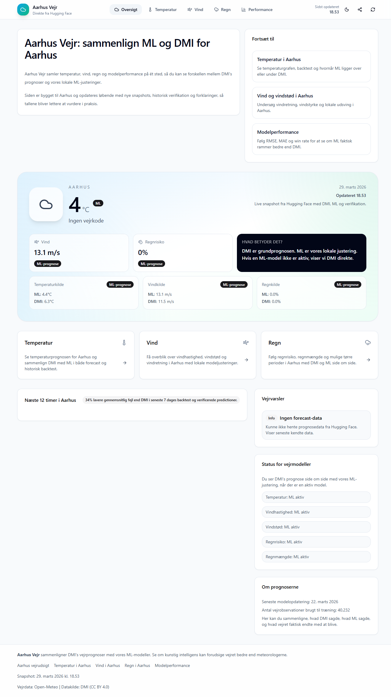
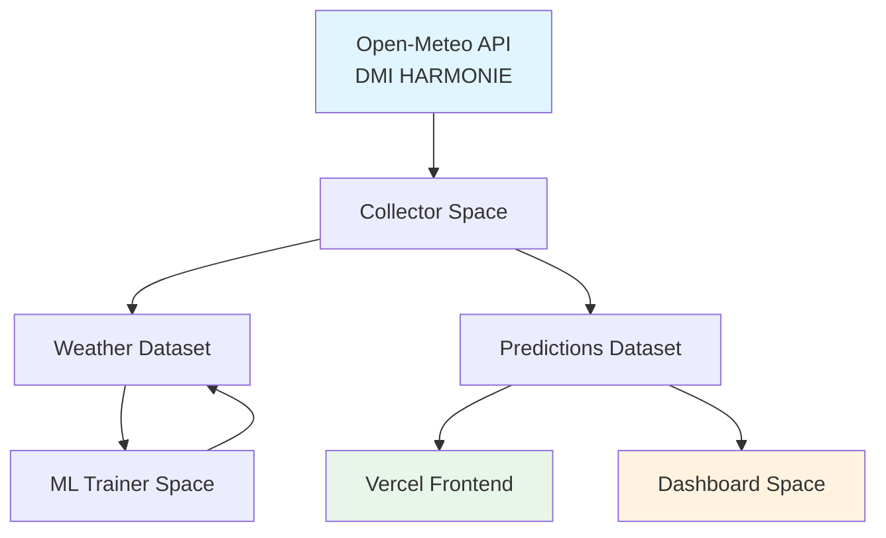

# 🌤️ Aarhus Vejr / Weather Predictor

> Lokale ML-forbedrede vejrprognoser for Aarhus baseret på DMI HARMONIE data

[](https://aarhus-vejr.vercel.app)
[](LICENSE)
[](https://huggingface.co/ciroc0)

[🇩🇰 **Se live demo**](https://aarhus-vejr.vercel.app) · [📊 Dashboard](https://huggingface.co/spaces/ciroc0/dmi-vs-ml-dashboard) · [📖 Dokumentation](docs/)

---



## ✨ Features

- **🌡️ Temperaturprognoser** – ML-korrigerede temperaturer sammenlignet med DMI's prognoser
- **💨 Vind og vindstød** – Prognoser for vindhastighed og vindstød i Aarhus
- **🌧️ Regnforudsigelse** – Sandsynlighed for regn og forventet mængde
- **📊 Performance-tracking** – Følg ML-modellernes nøjagtighed mod DMI baseline
- **🏙️ Aarhus-fokuseret** – Specialiseret til Aarhus' lokale mikroklima

## 🏗️ Arkitektur



| Komponent | Placering | Formål |
|-----------|-----------|--------|
| 🌐 **Frontend** | [`frontend/`](frontend/) | Vercel-hostet React webapp |
| 📡 **Collector** | `hf/spaces/dmi-collector/` | Data ingestion & predictions |
| 🧠 **ML Trainer** | `hf/spaces/dmi-ml-trainer/` | Model træning & deployment |
| 📊 **Dashboard** | `hf/spaces/dmi-vs-ml-dashboard/` | Visualisering & evaluering |
| 💾 **Weather Data** | `hf/datasets/dmi-aarhus-weather-data/` | Træningsdata & modeller |
| 📈 **Predictions** | `hf/datasets/dmi-aarhus-predictions/` | Live predictions & snapshots |

## 🚀 Kom i gang

### Frontend (lokal udvikling)

```bash
cd frontend
npm install
npm run dev
```

Frontenden kører på `http://localhost:5173` og kommunikerer med Hugging Face datasets.

### Hugging Face Spaces

Alle Spaces under `hf/` er separate git repositories med egen deployment. Se [`docs/hf-git-commands.md`](docs/hf-git-commands.md) for kommandoer.

## 🔄 Drift & Schedulers

| Space | Scheduler | Formål |
|-------|-----------|--------|
| Collector | `00:35, 03:35, 06:35, 09:35, 12:35, 15:35, 18:35, 21:35` | Nye predictions |
| Collector | Hver time `:12` | Verifikation af gamle predictions |
| Collector | Dagligt `05:45` | Træningsdata opdatering |
| ML Trainer | Søndag `06:50` | Gen-træning af modeller |

## 🧠 Modeller

Projektet bruger **XGBoost** med en multi-target, bucketed tilgang:

| Target | Type | Beskrivelse |
|--------|------|-------------|
| `temperature` | Regression | Korrektionsmodel oven på DMI forecast |
| `wind_speed` | Regression | Korrektionsmodel |
| `wind_gust` | Regression | Korrektionsmodel |
| `rain_event` | Klassifikation | Sandsynlighed for regn |
| `rain_amount` | Regression | Mængde (kun hvor regn er relevant) |

Lead buckets: `1-6`, `7-12`, `13-24`, `25-48` timer

## 📁 Projektstruktur

```
weather-predictor/
├── frontend/           # Vite + React 19 + TypeScript
├── docs/              # Dokumentation
│   ├── system-context.md    # Arkitektur & drift
│   ├── licensing.md         # Licensdetaljer
│   └── hf-git-commands.md   # HF workflow
├── scripts/           # Hjælpe-scripts
└── hf/               # Hugging Face repos
    ├── spaces/
    │   ├── dmi-collector/
    │   ├── dmi-ml-trainer/
    │   └── dmi-vs-ml-dashboard/
    └── datasets/
        ├── dmi-aarhus-weather-data/
        └── dmi-aarhus-predictions/
```

## 📜 Licens

Dette projekt bruger en **dual-license** model:

- **Kode** (`frontend/`, `scripts/`, `hf/spaces/`): [Apache-2.0](LICENSE)
- **Dokumentation & Data** (`README.md`, `docs/`, `hf/datasets/`): [CC BY 4.0](docs/licensing.md)

> **Attribution:** *Weather Predictor / Aarhus Vejr by Ciroc0*  
> **Datakilder:** Uses weather data delivered via Open-Meteo · Forecast source based on DMI HARMONIE

Se [docs/licensing.md](docs/licensing.md) for fulde detaljer.

## 🙏 Acknowledgments

- [Open-Meteo](https://open-meteo.com/) – Gratis vejrdata API
- [DMI](https://www.dmi.dk/) – Dansk Meteorologisk Institut
- [Hugging Face](https://huggingface.co/) – Hosting af Spaces og Datasets
- [Vercel](https://vercel.com/) – Frontend hosting

---

<p align="center">
  <sub>Bygget med ❤️ i Aarhus af <a href="https://github.com/ciroc0">Ciroc0</a></sub>
</p>
